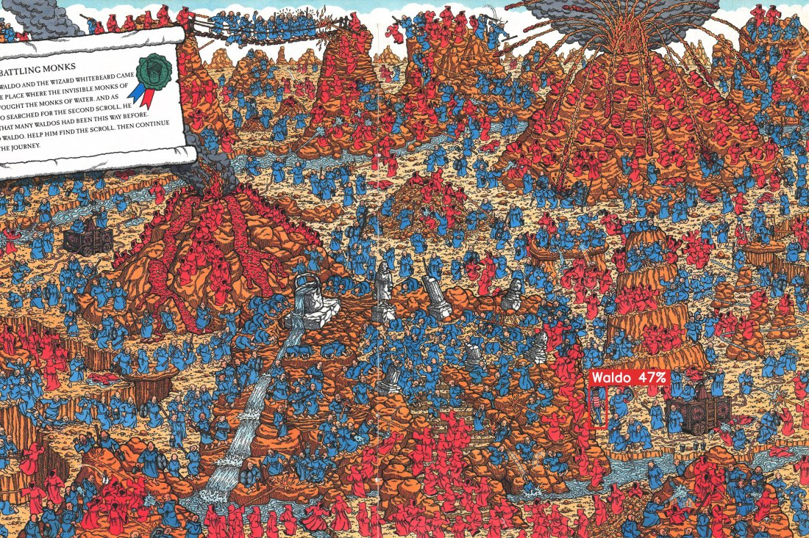
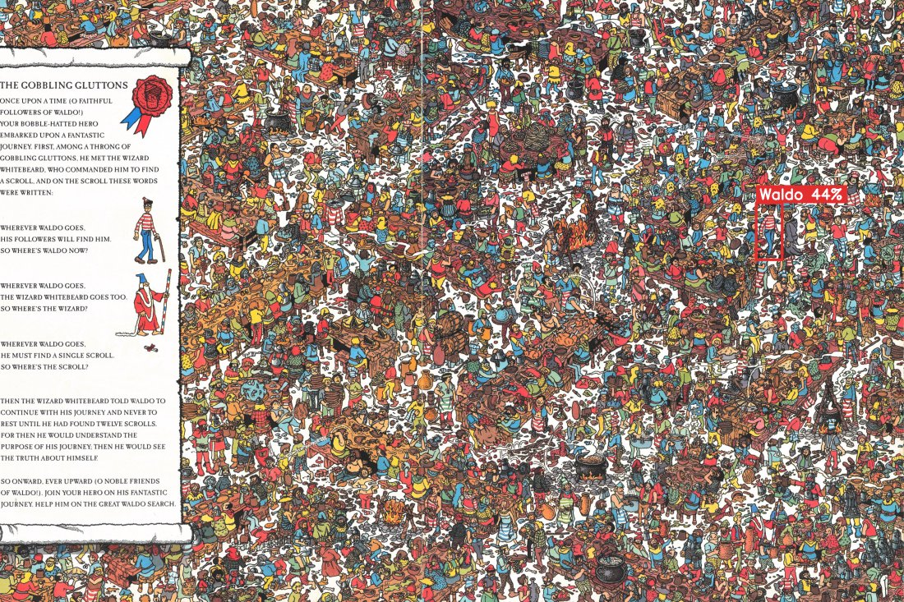
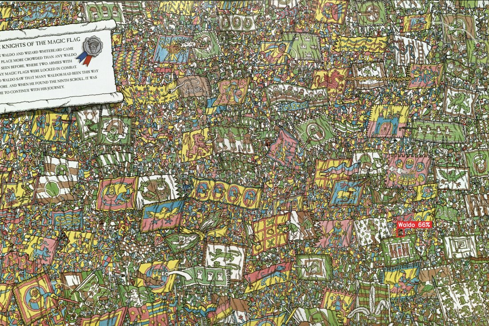
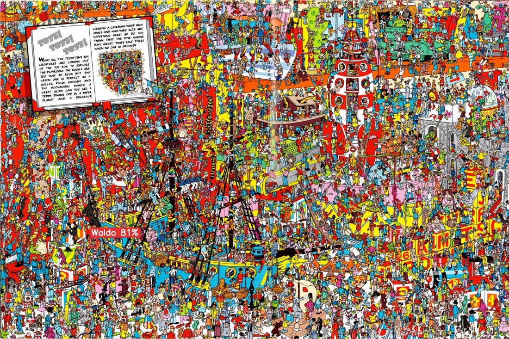

# Find Waldo

Detect Waldo in "Where's Waldo?" puzzle pages with a YOLOv8 detector, including
pages the model never trained on. The detector is standard; the work is in the
data and the evaluation: training on native-scale page tiles, adding decoy
characters as hard negatives, multi-scale tiled inference, and honest
leakage-safe evaluation.

**Headline result: page hit-rate 0.76 (16/21), 95% CI [0.55, 0.89]** on
held-out books the model never saw. Reported model: `waldo_book_decoy`.

## Contents

- [Motivation](#motivation)
- [Approach](#approach)
- [Project progress](#project-progress)
- [Example detections](#example-detections)
- [Results and metrics](#results-and-metrics)
- [Datasets](#datasets)
- [Web demo](#web-demo)
- [Quick start](#quick-start)
- [Repository layout](#repository-layout)
- [Limitations and future work](#limitations-and-future-work)
- [Credits and licence](#credits-and-licence)

## Motivation

"Where's Waldo" is a tiny-target search in dense, self-similar clutter. Waldo is
often only 10 to 40 pixels inside a page 2000 pixels or more across, and the
background is full of red-and-white distractors that look like him. The main
difficulty is not the detector, it is the data: the public datasets hold only a
few hundred labelled images, and shrinking a whole page to a small square
destroys the few pixels that make up Waldo.

This project addresses both problems:

1. It slices full pages into fixed 640 pixel tiles at native resolution, so
   Waldo stays large enough to learn and the training scale matches inference.
2. It adds decoy characters (Odlaw, Wizard) as hard negatives, which cuts the
   confident false positives that are the main failure mode on these pages.

## Approach

1. Label Waldo on real book pages (12 books).
2. Split the data by book, so no book appears in more than one split. This tests
   cross-book generalization and removes leakage.
3. Tile each page into 640 pixel tiles. A tile with Waldo is a positive (box
   re-computed inside the tile); other tiles are background negatives, capped at
   roughly three negatives per positive.
4. Mine real Odlaw and Wizard crops from a separate 5-class set and paste them
   onto Waldo-free tiles with empty labels, so the model learns Waldo
   specifically, not any red/white or striped pattern.
5. Train YOLOv8s from COCO weights.
6. At inference, slide windows at three sizes (320/512/768) over the full page,
   fuse detections with Weighted Boxes Fusion, and take the top-1 box per page.

## Project progress

The project went through five model versions. The key finding is that the big
improvement came from changing the training data, not from tuning the model.

| Model | Trained on | Page hit-rate (b04/b09) | Note |
|---|---|---|---|
| waldo_yolov8n | old single-class set | not comparable | earliest baseline (leaky split) |
| waldo_synth / waldo_synth_A | synthetic composites | ~0.00 | Track A, documented negative result |
| waldo_book_A | real book tiles | 0.48 | first model to find real Waldo |
| **waldo_book_decoy** | real tiles + decoys | **0.76** (multi-scale) | **reported model** |
| waldo_book_ms | multi-scale tiles + copy-paste | 0.71 | larger-data experiment, tied with decoy |

Status: reported model locked. Web demo working. Poster deliverables assembled
under `poster_deliverables/`. Book-fold cross-validation and multi-class
detection are the main open items.

## Example detections

The reported model (`waldo_book_decoy`) on held-out book pages it never trained
on. The red box is the top-1 detection with its confidence.

<p align="center">
  
  
</p>
<p align="center">
  
  
</p>

The top row is from the held-out test book The Great Waldo Search, which the
model never trained on, so those are genuine cross-book detections. The bottom
row shows two more example pages (a flag-filled battle and a crowded toy scene).
The top-left is a hard case: Waldo boxed among a crowd of red and blue monks.

## Results and metrics

All numbers are on the held-out test books **b04 + b09** (split by book, never
seen in training): 21 pages, 58 Waldo instances (small, so treat as
directional). Page hit-rate = does the top-1 box land on the real Waldo,
IoU >= 0.5. Confidence intervals are 95% Wilson score intervals.

### Lineage (how the result was built up)

| Stage | Page hit-rate | 95% CI |
|---|---|---|
| Synthetic-only (Track A, negative result) | 0/21 = 0.00 | [0.00, 0.15] |
| Real page tiles | 10/21 = 0.48 | [0.28, 0.68] |
| + decoy hard-negatives (single-scale inference) | 13/21 = 0.62 | [0.41, 0.79] |
| + multi-scale WBF inference (reported) | 16/21 = 0.76 | [0.55, 0.89] |

The large, defensible jump is synthetic (0.00) to real page tiles (0.48). At
n=21 the single-step increments have overlapping CIs, so the honest claim is the
cumulative 0.00 to 0.76.

### Decoy hard-negatives ablation (tile level, single-scale)

| Metric | Real tiles | + decoys |
|---|---|---|
| Tile mAP@0.5 | 0.60 | 0.66 |
| Tile mAP@0.5:0.95 | 0.24 | 0.24 |
| Precision | 0.54 | 0.79 |
| Recall | 0.63 | 0.57 |

Precision (0.54 to 0.79) and threshold-independent mAP@0.5 (0.60 to 0.66) are
the credible gains. Precision/recall are at a fixed 0.25 threshold, so that
split is partly threshold placement.

### Training (validation) metrics

Validation books are b11 + b16. Best-epoch values from each run's results.csv.

| Model | Epochs | Best epoch | Val mAP@0.5 | Val mAP@0.5:0.95 | Val precision | Val recall |
|---|---|---|---|---|---|---|
| waldo_book_decoy | 100 | 92 | 0.752 | 0.315 | 0.748 | 0.746 |
| waldo_book_ms | 88 | 68 | 0.813 | 0.378 | 0.804 | 0.793 |

Note: waldo_book_ms has higher validation mAP but does not beat the reported
model on the task-relevant test page hit-rate. Val mAP is tile-level; test page
hit-rate is top-1 on the real Waldo.

### Model comparison on the test (multi-scale WBF)

| Model | Page hit-rate | 95% CI |
|---|---|---|
| waldo_book_decoy | 16/21 = 0.76 | [0.55, 0.89] |
| waldo_book_ms | 15/21 = 0.71 | [0.50, 0.86] |

Net difference is 1 page, inside the n=21 noise and with overlapping CIs, so it
is a statistical tie. Reported model is waldo_book_decoy.

### Out-of-distribution stress test

On a completely unseen book ("Where's Waldo Now", pages 9-31, 23 pages):

| Inference | Pages with a detection |
|---|---|
| Single-scale, conf 0.25 | 5/23 |
| Single-scale, conf 0.10 | 7/23 |
| Multi-scale WBF, conf 0.10 | 7/23 |

Even at a permissive threshold most pages produce no detection, a genuine
recognition gap on a new art style rather than under-confidence.

### Failure analysis

The 5 missed test pages are the hardest cases: a tiny occluded Waldo (26x52 px),
one camouflaged next to a red/white awning, and a few small/occluded ones. Box
sizes across all 120 labelled instances range 28 to 356 px (mean 102 px). Label
caveat: 2 of the missed pages are labelled on the look-alike Wenda, not Waldo,
so they are arguably label noise.

## Datasets

Final-model training data: real book-page tiles plus decoy hard-negatives, split
by book.

| Split | Positive tiles | Negative tiles | Books |
|---|---|---|---|
| train | 219 | 889 (669 background + 220 decoy) | b01, b02, b03, b05, b07, b08, b10, b12 |
| val | 71 | 210 | b11, b16 |
| test | 58 | 174 | b04, b09 |

- Book pages: 12 books, 128 labelled pages (119 with Waldo, 9 negatives), 120
  Waldo boxes. Raw scans are copyrighted and kept local (git-ignored); labels
  and scripts reproduce the tiled dataset.
- Decoy source: a 5-class Roboflow dataset (Odlaw and Wizard crops only).
- See `DATASETS.md` and `poster_deliverables/SOURCES.md` for sources, licences,
  and the leakage-safe splitting.

## Web demo

`web/app.py` is a local Flask app to try the detector on any image.

1. **Upload** a page.
2. **Enhance (optional)**: local sharpen + upscale, Real-ESRGAN, or the finegrain
   diffusion enhancer (remote, needs internet). Shows a before/after.
3. **Confidence threshold** slider.
4. **Find Waldo** runs the multi-scale WBF pipeline and shows a found badge,
   stats, and a detections list. Only the top-1 box is drawn by default; click a
   row to toggle any other detection's box (browser overlays, so they stay
   crisp).

Run `python web/app.py`, then open http://localhost:8080.

## Quick start

```bash
conda env create -f environment.yml && conda activate waldo-finder   # or: pip install -r requirements.txt

python scripts/build_book_dataset.py                          # tile labelled pages, split by book
python scripts/build_decoys.py                                # add Odlaw/Wizard hard negatives
python scripts/train_synth.py --data data/book_decoy.yaml \
    --model yolov8s.pt --epochs 100 --name waldo_book_decoy --close-mosaic 10
python scripts/detect_multiscale.py --weights models/waldo_book_decoy/weights/best.pt \
    --books b04,b09                                           # evaluate on held-out books
python scripts/detect_any.py --image path/to/page.jpg \
    --weights models/waldo_book_decoy/weights/best.pt         # find Waldo in any page
```

## Repository layout

```
waldo-finder/
  scripts/
    build_book_dataset.py   tile labelled pages into 640 tiles, split by book
    build_decoys.py         mine Odlaw/Wizard crops, build decoy-negative tiles
    build_dataset_ms.py     multi-scale + copy-paste dataset builder
    train_synth.py          train YOLOv8 (auto-selects MPS, CUDA, or CPU)
    detect_any.py           single-scale tiled inference on any image
    detect_multiscale.py    multi-scale tiled inference with Weighted Boxes Fusion
    eval_synth.py           mAP, precision, recall on a held-out split
    compare_models.py       run several models on the same test set
    book_fold_cv.py         book-fold cross-validation
  synth/                    earlier synthetic-compositing pipeline (reference)
  src/                      earlier baseline scripts (template match, prep)
  web/                      Flask demo (upload an image, get detections)
  data/                     datasets, kept local and git-ignored
  poster_deliverables/      metrics, sources, figures, per-model result images
  DATASETS.md               source inventory, licences, leakage controls
```

## Limitations and future work

- Small test set (n=21 pages), so single-step gains have overlapping CIs.
  Book-fold cross-validation would firm up the numbers.
- Out-of-distribution gap: on a brand-new book's art style the model finds Waldo
  on a minority of pages.
- 5 test pages remain unsolved (tiny / occluded / camouflaged), 2 of which are
  labelled on the look-alike Wenda.
- Future: book-fold cross-validation, more labelled books, and multi-class
  detection (Waldo, Odlaw, Wizard, Wenda) for a confusion matrix.

## Credits and licence

- Hey-Waldo dataset, Valentino Constantinou (vc1492a): https://github.com/vc1492a/Hey-Waldo
- HereIsWally, Tadej Magajna: https://github.com/tadejmagajna/HereIsWally (MIT)
- YOLOv8, Ultralytics: https://github.com/ultralytics/ultralytics (AGPL-3.0)
- Weighted Boxes Fusion (ensemble-boxes, MIT): https://github.com/ZFTurbo/Weighted-Boxes-Fusion

Code is released under the repository licence. Datasets retain their original
licences (see `DATASETS.md` and `poster_deliverables/SOURCES.md`). Raw book-page
scans are copyright Martin Handford and the respective publishers and are not
redistributed here.
